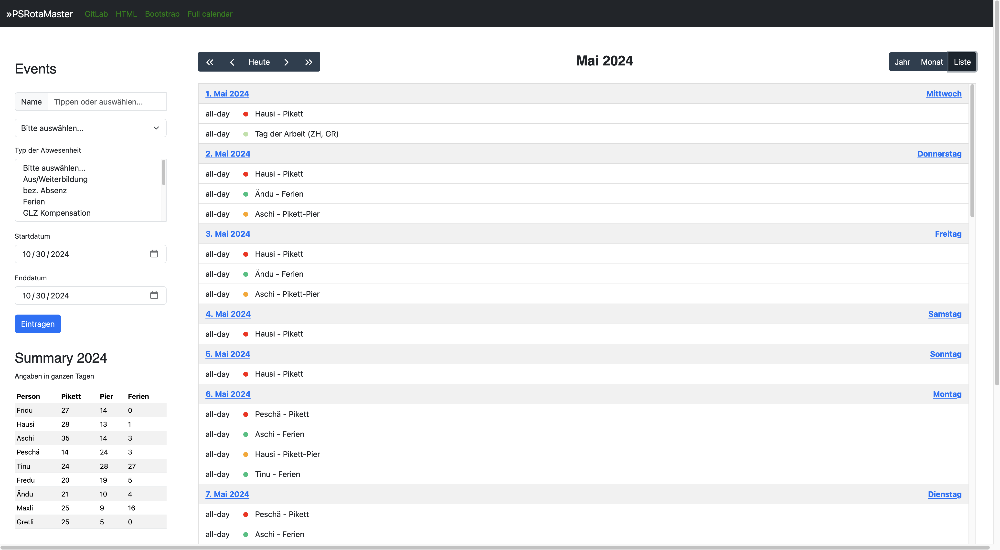
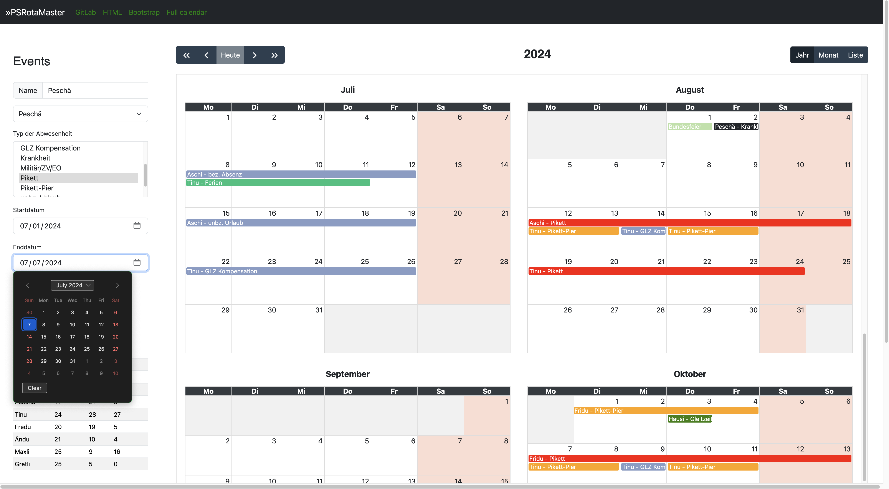

# PSRotaMaster V2

Absence and Duty Planer for Teams built on Pode, based on Prompting ChatGPT. Maybee some features does not exists or does not work. I changed from Pode.web to Pode, because it's easier to implement JavaScript-code.

## Full calendar view

Based on the [JavaScript Calendar](https://fullcalendar.io/)

In this calendar view, you can view the events of the current month, scroll to another month, and add new events.

Each time the page is loaded, the system checks whether the file for the next year's holidays already exists. If the file does not yet exist, the public holidays in Switzerland are calculated for the cantons of Bern, Zurich, St. Gallen and Graubünden and the file is created with these values. You never have to worry about it again, the public holidays are simply there.


To show the current month, click on the middle button 'month'.


Or if you prefere a list of the events of the current month, click on the right button 'list'.



### Add a range with form datas

Type the person and select absence-type, choose the start- and end date, and press the button to submit the new event.



### Add a range with selecting dates

Select a range fills the selected start- and end date into the formular. Type the person and select the absence-type and press the button to submit the new event.


If you want to create the holidays for a different year, you can call the API with the desired year.

For example with PowerShell: ````Invoke-WebRequest -Uri http://localhost:8080/api/year/new -Method Post -Body 2025````

## Functionality

The PSRotaMaster is a Web service based on Pode.

All of the APIs on the backend are written in PowerShell and the frontend is written in JavaScript and HTML/CSS.

## Folders

The PSRotaMaster needs the following folder-structure:

````cmd
PSRotaMaser
+---archiv
+---bin
+---db
+---errors
+---img
+---public
|   +---assets
|   |   +---BootStrap
|   |   +---img
|   |   +---Jquery
|   |   \---psrotamaster
|   \---img
\---views
````

### PSRotaMaser

This is the root-folder for the web service. Here must be the PodeServer.ps1 located.

### archiv

For obsolete files, that you want to archive and not load in to the calendar.

### bin

This folder contains the PowerShell code of the backend.

### db

This folder contains the files or the database of the Web service. For example, the files for the public holidays, the absence type, or the persons.

The files for the absence- and persons must be JSON-files, and the files that contains the public holidays and the calendar are currently CSV-files.

### errors

This is an internal folder for the error-page.

### img

Here are the images for the readme.

### public

This folder is public for the web service and should contains all the assets you need.

### views

This is the folder where the index.html is saved.
