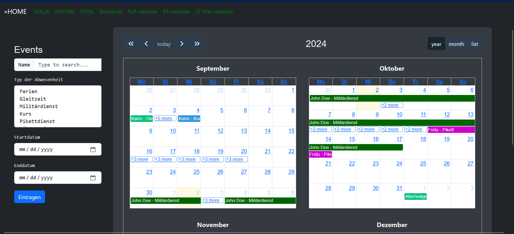
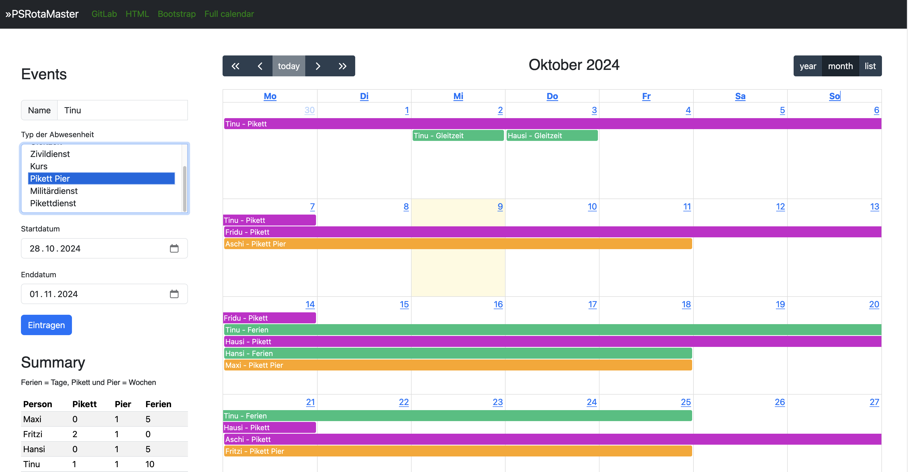
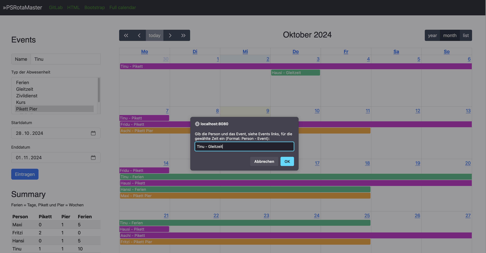

# PSRotaMaster V2

Absence and Duty Planer for Teams built on Pode, based on Prompting ChatGPT. Maybee some features does not exists or does not work. I changed from Pode.web to Pode, because it's easier to implement JavaScript-code.

## Full calendar view

Based on the [JavaScript Calendar](https://fullcalendar.io/)

In this calendar view, you can view the events of the current month, scroll to another month, and add new events.

To add new event, type the name of the person to serach for. The list of persons and the absence-types are stored in the server.psd1 in the root folder of the project. The Type of absence can be selected from the dropdown-field.

Each time the page is loaded, the system checks whether the file for the next year's holidays already exists. If the file does not yet exist, the public holidays in Switzerland are calculated for the cantons of Bern, Zurich, St. Gallen and Graubünden and the file is created with these values. You never have to worry about it again, the public holidays are simply there.


To show the whole year, click on the left button 'year'.



Or if you prefere a list of the events of the current month, click on the right button 'list'.


### Add a range with form datas

Type the person and select absence-type, choose the start- and end date, and press the button to submit the new event.



### Add a range with selecting dates

Select a range fills the selected start- and end date into the formular. Type the person and select the absence-type and press the button to submit the new event.



If you want to create the holidays for a different year, you can call the API with the desired year.

For example with PowerShell: ````Invoke-WebRequest -Uri http://localhost:8080/api/year/new -Method Post -Body 2025````
