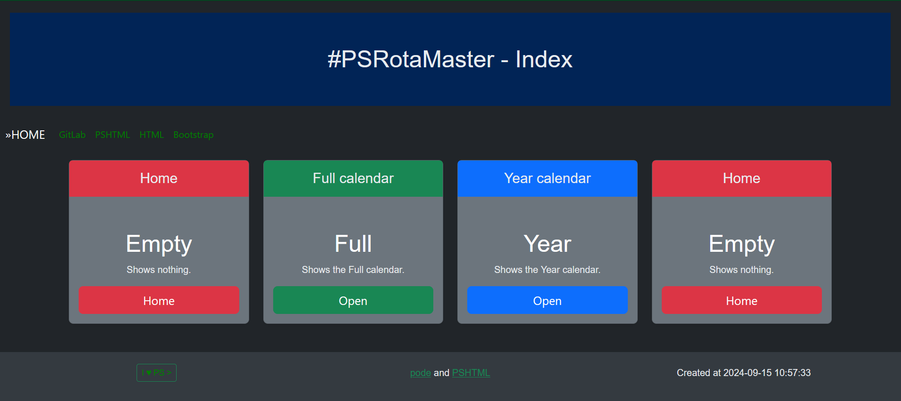
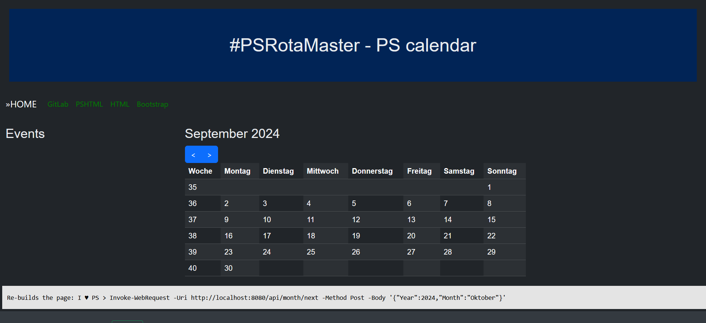
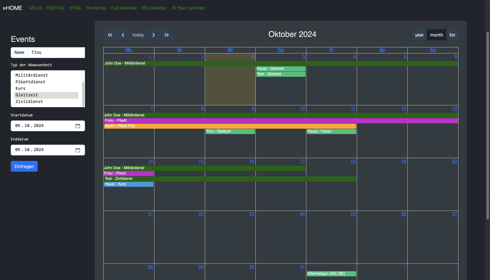
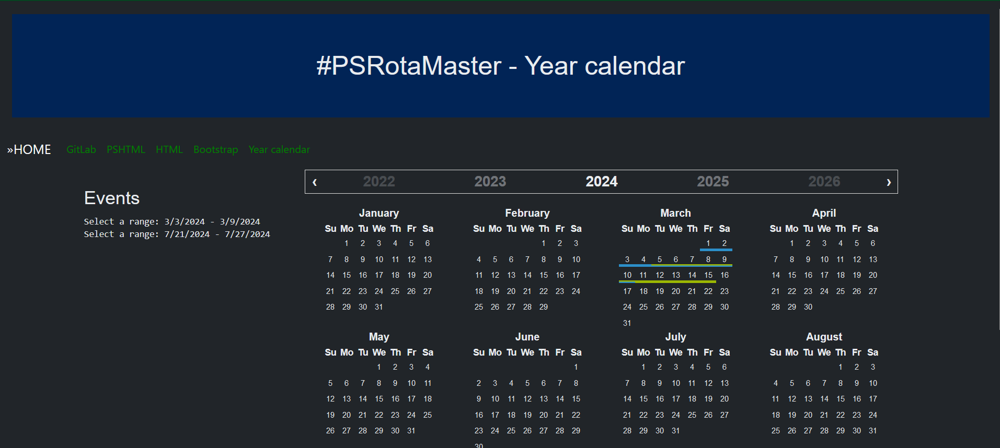

# RotaMaster

Absence and Duty Planer for Teams built on Pode, based on Prompting ChatGPT. Maybee some features does not exists or does not work. I changed from Pode.web to Pode, because it's easier to implement JavaScript-code.

## PS calendar view

## Full calendar view

## Year calendar view

## Folders

The following folders are required by RotaMaster.

### bin

Contains the start-command/script.

### db

Contains the database.

### errors

Contains the default error page.

### logs

Contains the logs.

### pages

Contains the PowerShell-Pages for Pode.web to render the html-pages from.

### public

Contains the assets (bootstrap, css, js).

### upload

For uploaded files.

## JavaScript

[Year calendar examples](https://year-calendar.github.io/rc-year-calendar/examples)

[Bootstrap Year calendar](https://github.com/year-calendar/js-year-calendar?tab=readme-ov-file)

[Full Calendar](https://fullcalendar.io/docs)
