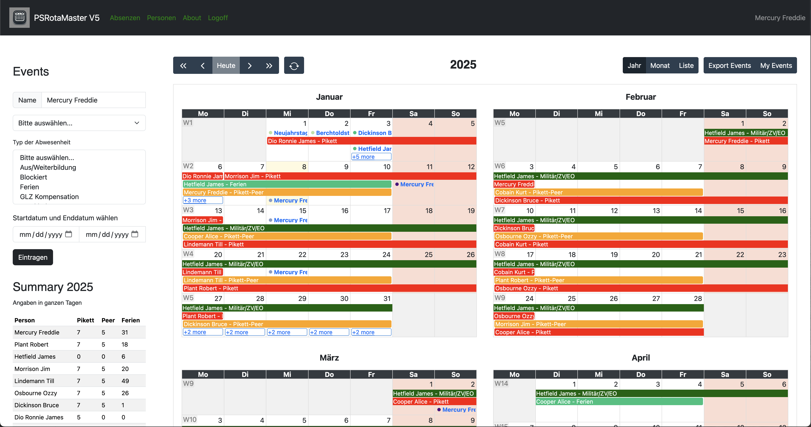
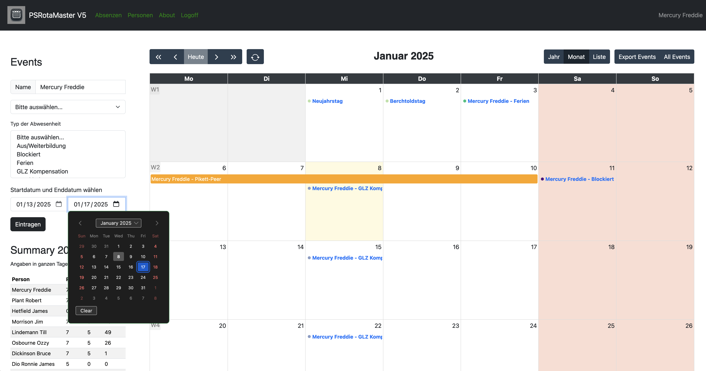
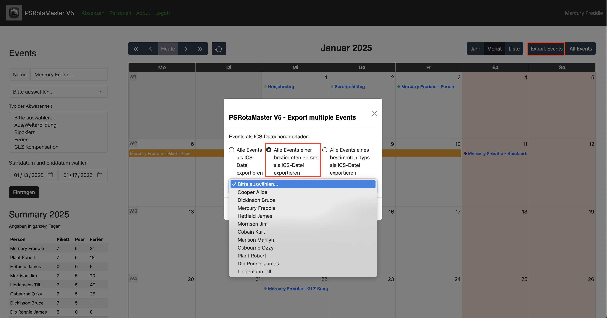
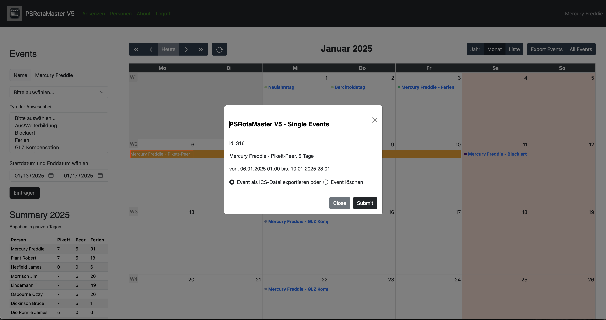

# RotaMaster V5

The RotaMaster is a Web service based on Pode.

All of the APIs on the backend are written in PowerShell and the frontend is written in JavaScript and HTML/CSS.

Absence and duty scheduling program for teams based on Pode, and [FullCalendar](https://fullcalendar.io/), created with ChatGPT prompt for JavaScript.

Each time the page is loaded, the system checks whether the file for the next year's holidays already exists. If the file does not yet exist, the public holidays in Switzerland are calculated for the cantons of Bern, Zurich, St. Gallen and Graubünden and the file is created with these values. You never have to worry about it again, the public holidays are simply there.

If you want to create the holidays for a different year, you can call the API with the desired year. For example with PowerShell:

````Invoke-WebRequest -Uri http://localhost:8080/api/year/new -Method Post -Body 2025````

It possible to use the [OpsGenie API](https://docs.opsgenie.com/docs/api-overview) to create and delete Pikett-events in OpsGenie.

## Login

At first, you have to login.


## Year view

In this calendar view, you can view the events of the current month, scroll to another month, and add new events.



## Month view

To show the current month, click on the middle button 'month'.


## List view

Or if you prefere a list of the events of the current month, click on the right button 'list'.


## Show my events

To show only your own events, press the button 'My Events'.


## Add a range with form dates

Type, or select the person and select absence-type, choose the start- and end date, and press the button to submit the new event.



## Add a range with selecting dates

Select a range fills the selected start- and end date into the formular. Type or select the person and select the absence-type and press the button to submit the new event.


## Export

It's possible to export all events,


or events of a specified person,



or of a specified type,


or a single event as an ics-file.



## Absence Management

To manage your absences, click on the link in the navbar 'Absenzen'.


## Person Management

To manage your persons, click on the link in the navbar 'Personen'. If a person is a member of the on-call team, set the value for Active to 1, otherwise to 0. The workload value has no function yet.


## About

A list of some components and their version. Show is OpsGenie integration.


## OpsGenie

Add new OpsGenie Override for a specified person and on-call time.


Synchronize/refresh the calendar and the OpsGenie Schedule.


There is a PowerShell-Script with all functions for CR(U)D operations:

````powershell
RotaMster/test/New-OpsGenieOverride.ps1
````

## Modules

The following PowerShell-Modules are mandatory:

- Pode
- PSSQLite

## Folders

The RotaMaster needs the following folder-structure:

````cmd
RotaMaster
+---api
+---archiv
+---bin
+---errors
+---img
+---public
|   +---assets
|   |   +---BootStrap
|   |   +---img
|   |   +---Jquery
|   |   \---rotamaster
|   \---img
\---views
````

## Create On-Call-Schedule

Currently there is a PowerShell-Script to create a new rotation and save it as RotaMaster/api/on-call-rota-2025.csv:

````powershell
RotaMaster/bin/New-OnCallSchedule.ps1 -StartDate '2025-03-01' -EndDate '2025-12-31'
````

You can check this ratation in the RotaMaster-calendar and if the rotation passed, then you can import it in to the table events with a PowerShell-Script:

````powershell
RotaMaster/bin/Import-ToSqLiteTable.ps1 -FilePath ../api/on-call-rota-2025.csv -ImportToDatabase
````
