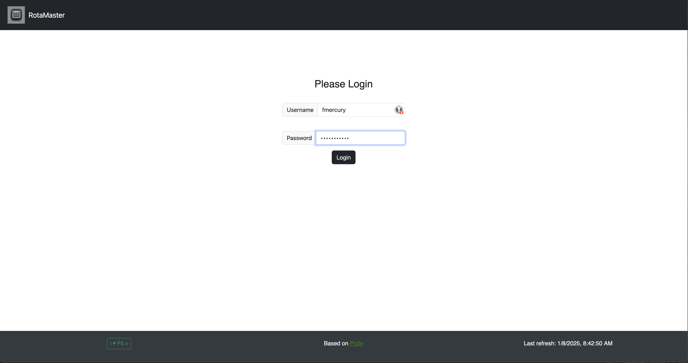
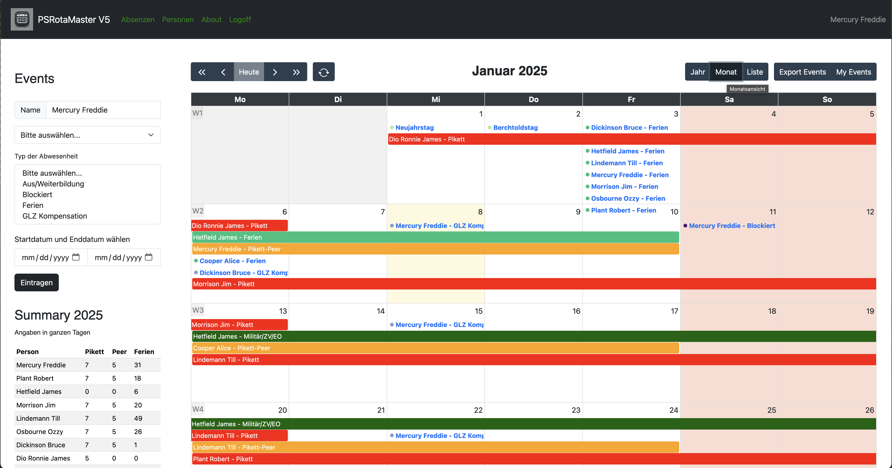
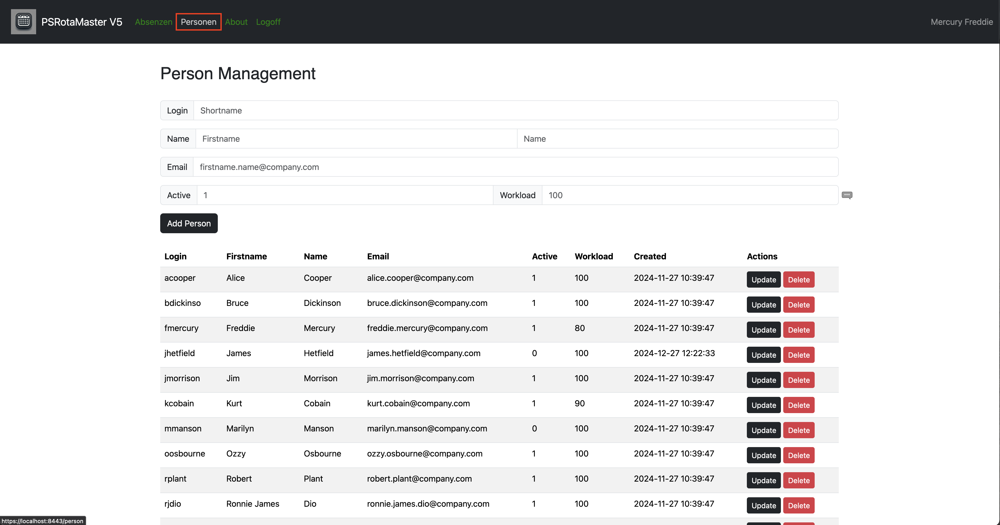

# RotaMaster V5

The RotaMaster is a Web service based on Pode.

All of the APIs on the backend are written in PowerShell and the frontend is written in JavaScript and HTML/CSS.

Absence and duty scheduling program for teams based on Pode, and [FullCalendar](https://fullcalendar.io/), created with ChatGPT prompt for JavaScript.

Each time the page is loaded, the system checks whether the file for the next year's holidays already exists. If the file does not yet exist, the public holidays in Switzerland are calculated for the cantons of Bern, Zurich, St. Gallen and Graubünden and the file is created with these values. You never have to worry about it again, the public holidays are simply there.

If you want to create the holidays for a different year, you can call the API with the desired year. For example with PowerShell:

````Invoke-WebRequest -Uri http://localhost:8080/api/year/new -Method Post -Body 2025````

It possible to use the [OpsGenie API](https://docs.opsgenie.com/docs/api-overview) to create and delete Pikett-events in OpsGenie.

## Start the RotaMster

Open a PowerShell and navigate to the RotaMaster-path and run the following command:

````powershell
pwsh .\PodeServer.ps1
````

````powershell
Pode v2.11.1 (PID: 1656)
Press Ctrl. + C to terminate the Pode server
VERBOSE: Adding Route: [Get] /
VERBOSE: Adding Route: [Get] /login
VERBOSE: Adding Route: [Post] /login
VERBOSE: Adding Route: [Post] /logout
VERBOSE: Adding Route: [Get] /logout
VERBOSE: Adding Route: [Get] /absence
VERBOSE: Adding Route: [Get] /person
VERBOSE: Adding Route: [Get] /about
VERBOSE: Adding Route: [Post] /api/year/new
VERBOSE: Adding Route: [Get] /api/csv/read
VERBOSE: Adding Route: [POST] /api/absence/create
VERBOSE: Adding Route: [Get] /api/absence/read/(?<id>[^\/]+?)
VERBOSE: Adding Route: [PUT] /api/absence/update/(?<id>[^\/]+?)
VERBOSE: Adding Route: [DELETE] /api/absence/delete/(?<id>[^\/]+?)
VERBOSE: Adding Route: [POST] /api/person/create
VERBOSE: Adding Route: [Get] /api/person/read/(?<person>[^\/]+?)
VERBOSE: Adding Route: [PUT] /api/person/update/(?<id>[^\/]+?)
VERBOSE: Adding Route: [DELETE] /api/person/delete/(?<id>[^\/]+?)
VERBOSE: Adding Route: [POST] /api/event/create
VERBOSE: Adding Route: [Get] /api/event/read/(?<person>[^\/]+?)
VERBOSE: Adding Route: [Put] /api/event/update/(?<id>[^\/]+?)
VERBOSE: Adding Route: [Delete] /api/event/delete/(?<id>[^\/]+?)
VERBOSE: Adding Route: [POST] /api/opsgenie/override/create
VERBOSE: Adding Route: [PUT] /api/opsgenie/override/update
VERBOSE: Adding Route: [DELETE] /api/opsgenie/override/delete
VERBOSE: Opening RunspacePools
VERBOSE: RunspacePool for Schedules: Opened [duration: 1.823797s]
VERBOSE: RunspacePool for Timers: Opened [duration: 1.8336919s]
VERBOSE: RunspacePool for Web: Opened [duration: 1.8347464s]
VERBOSE: RunspacePool for Main: Opened [duration: 1.8356756s]
VERBOSE: RunspacePools opened [duration: 1.841815s]
VERBOSE: Waiting for the Web RunspacePool to be Ready
VERBOSE: Web RunspacePool Ready [duration: 0.0025016s]
Listening on the following 1 endpoint(s) [2 thread(s)]:
        - https://localhost:8443/
````

## Login

Start your favorite browser and enter the url from above. At first, you have to login.



## Year view

In this calendar view, you can view the events of the current month, scroll to another month, and add new events.


## Month view

To show the current month, click on the middle button 'month'.



## List view

Or if you prefere a list of the events of the current month, click on the right button 'list'.


## Show my events

To show only your own events, press the button 'My Events'.


## Add a range with form dates

Type, or select the person and select absence-type, choose the start- and end date, and press the button to submit the new event.


## Add a range with selecting dates

Select a range fills the selected start- and end date into the formular. Type or select the person and select the absence-type and press the button to submit the new event.


## Export

It's possible to export all events,


or events of a specified person,


or of a specified type,


or a single event as an ics-file.


## Absence Management

To manage your absences, click on the link in the navbar 'Absenzen'.


## Person Management

To manage your persons, click on the link in the navbar 'Personen'. If a person is a member of the on-call team, set the value for Active to 1, otherwise to 0. The workload value has no function yet.



## About

A list of some components and their version. Show is OpsGenie integration.


## OpsGenie

Add new OpsGenie Override for a specified person and on-call time.


Synchronize/refresh the calendar and the OpsGenie Schedule.


There is a PowerShell-Script with all functions for CR(U)D operations:

### List schedule

````powershell
RotaMaster/bin/Invoke-OpsGenieMaintenace.ps1 -ScheduleName 'tinu_schedule' -ListSchedule
````

````powershell
id          : d23d8864-6895-49eb-9950-147f04d56b43
name        : tinu_schedule
description : 
timezone    : Europe/Belgrade
enabled     : True
ownerTeam   : @{id=d148162a-1388-4dde-8b3c-41cf66e0b8e8; name=tinu}
rotations   : {}
````

### List all rotations

````powershell
RotaMaster/bin/Invoke-OpsGenieMaintenace.ps1 -ScheduleName 'tinu_schedule' -ListRotations
````

````powershell
id              : 181fe0d8-8728-4ecf-8b94-fb1dce917b1f
name            : 2025
startDate       : 1/1/2025 9:00:00 AM
endDate         : 12/31/2025 9:00:00 AM
type            : weekly
length          : 1
timeRestriction : 
username        : 
````

### List all overrides

````powershell
RotaMaster/bin/Invoke-OpsGenieMaintenace.ps1 -ScheduleName 'tinu_schedule' -ListOverrides
````

````powershell
alias     : ec094825-296b-4d12-ab8d-c267db94d137
username  : bruce.dickinson@company.com
startDate : 3/3/2025 9:00:00 AM
endDate   : 3/10/2025 9:00:00 AM
rotations : 2025
````

### Remove obsolete override

````powershell
$alias = 'ec094825-296b-4d12-ab8d-c267db94d137'
RotaMaster/bin/Invoke-OpsGenieMaintenace.ps1 -ScheduleName 'tinu_schedule' -RemoveOverride -Alias $alias
````

````powershell
result   took requestId
------   ---- ---------
Deleted 0.236 aeb16668-18c0-42ae-8af1-68b95341de59
````

## Modules

The following PowerShell-Modules are mandatory:

- Pode ``Install-Module -Name Pode -Repository PSGallery -PassThru -Verbose``
- PSSQLite ``Install-Module -Name PSSQLite -Repository PSGallery -PassThru -Verbose``

## Folders

The RotaMaster needs the following folder-structure:

````cmd
RotaMaster
+---api
+---archiv
+---bin
+---errors
+---img
+---public
|   +---assets
|   |   +---BootStrap
|   |   +---img
|   |   +---Jquery
|   |   \---rotamaster
|   \---img
\---views
````

## Configuration

The configurations are hosted in ``RotaMaster/public/assets/rotamaster/rotamaster.config.js``.

````javascript
appVersion: "5.4.0",
appPrefix: "PS",
opsGenie: true,
scheduleName: 'tinu_schedule',
rotationName: '2025',
timeZone: 'local',
locale: 'de-CH',
themeSystem: 'standard',
initialView: 'multiMonthYear',
multiMonthMinWidth: 350,
multiMonthMaxColumns: 2,
headerToolbar: {
    left: 'prevYear,prev,today,next,nextYear refreshButton',
    center: 'title',
    right: 'multiMonthYear,dayGridMonth,listMonth exportToIcs,filterEvents'
},
buttonText: {
    today: 'Heute',
    year: 'Jahr',
    month: 'Monat',
    list: 'Liste'
},
weekNumbers: true,
dayMaxEvents: true,
showNonCurrentDates: false,
fixedWeekCount: false,
weekNumberCalculation: 'ISO',
selectable: true,
editable: true,
displayEventTime: false,
navLinks: true
````

## Initialize new database

To remove the default database and initialize a new empty database, use the Script Invoke-SQLiteMaintenance.ps1.

Backup and remove the current database:

````powershell
.\RotaMaster\bin\Invoke-SQLiteMaintenance.ps1 -RemoveDatabase
````

````powershell
Confirm
Are you sure you want to perform this action?
Performing the operation "Remove File" on target "D:\github.com\RotaMaster\api\rotamaster.db".
[Y] Yes  [A] Yes to All  [N] No  [L] No to All  [S] Suspend  [?] Help (default is "Y"): y
Name           FullName
----           --------
rotamaster.bak D:\github.com\RotaMaster\archiv\rotamaster.bak
````

Create a new database with the tables and views that are mandatory:

````powershell
.\RotaMaster\bin\Invoke-SQLiteMaintenance.ps1 -NewDatabase
````

````powershell
type  name             tbl_name         rootpage sql
----  ----             --------         -------- ---
table events           events                  2 CREATE TABLE events(…
table person           person                  4 CREATE TABLE person(  …
table absence          absence                 5 CREATE TABLE absence(  …
view  v_events         v_events                0 CREATE VIEW v_events…
view  v_events_deleted v_events_deleted        0 CREATE VIEW v_events_deleted…
view  v_pikett         v_pikett                0 CREATE VIEW v_pikett…
````

Check for the FullCalendar view:

````powershell
.\RotaMaster\bin\Invoke-SQLiteMaintenance.ps1 -Query 'SELECT * FROM v_events'
````

If you see the following output, then you can start the RotaMster.

````powershell
id        : 1
person    : Cooper Alice
type      : Initialize DB
start     : 2025-01-01 01:00
end       : 2025-01-01 23:00
alias     :
login     : admin
firstname : Alice
name      : Cooper
email     : acooper@local.com
created   : 2025-01-05 13:09:04
author    : Administrator
````

After the login, you should see the following calendar-events:


Check table events:

````powershell
.\RotaMaster\bin\Invoke-SQLiteMaintenance.ps1 -Query 'SELECT * FROM events'
````

````powershell
id      : 1
person  : Cooper Alice
type    : Initialize DB
start   : 2025-01-01 01:00
end     : 2025-01-01 23:00
alias   :
active  : 1
created : 2025-01-05 13:09:04
deleted :
author  : Administrator
````

Checks table person:

````powershell
.\RotaMaster\bin\Invoke-SQLiteMaintenance.ps1 -Query 'SELECT * FROM person'
````

````powershell
id        : 1
login     : admin
name      : Cooper
firstname : Alice
email     : acooper@local.com
active    : 0
workload  : 0
created   : 2025-01-05 13:09:04
author    : Administrator
````

Check table absence:

````powershell
.\RotaMaster\bin\Invoke-SQLiteMaintenance.ps1 -Query 'SELECT * FROM absence'
````

````powershell
id      : 1
name    : Ferien
created : 2025-01-05 13:09:04
author  : Administrator
````

## Create On-Call-Schedule

Currently there is a PowerShell-Script to create a new rotation and save it as RotaMaster/api/on-call-rota-2025.csv:

````powershell
RotaMaster/bin/New-OnCallSchedule.ps1 -StartDate '2025-03-01' -EndDate '2025-12-31'
````

You can check this rotation in the RotaMaster-calendar and if the rotation passed, then you can import it in to the table events (but NOT into OpsGenie) with a PowerShell-Script:

````powershell
RotaMaster/bin/Import-ToSqLiteTable.ps1 -FilePath ../api/on-call-rota-2025.csv -ImportToDatabase
````

## Video

Sorry, but the video is only in (swiss)-german on YouTube as [RotaMaster](https://youtu.be/GWp0dQvSQC8).
