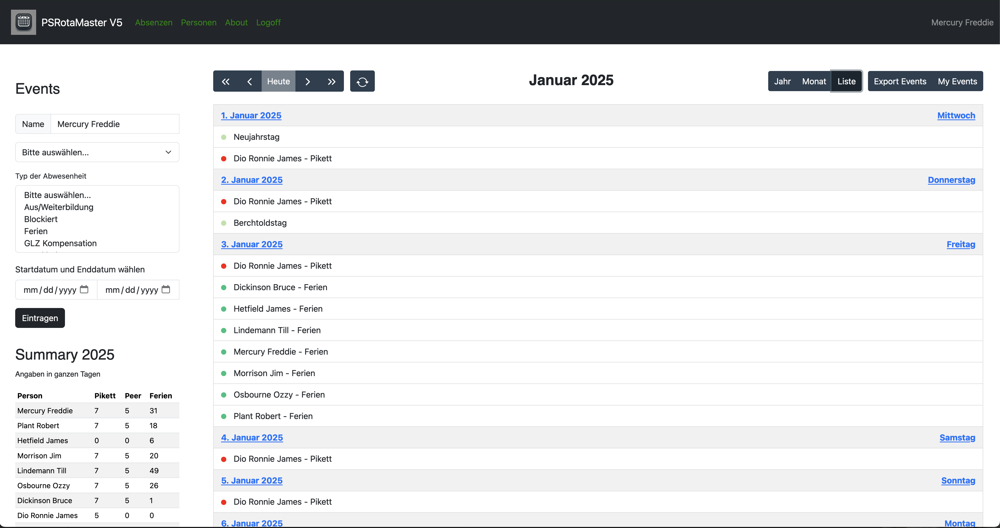
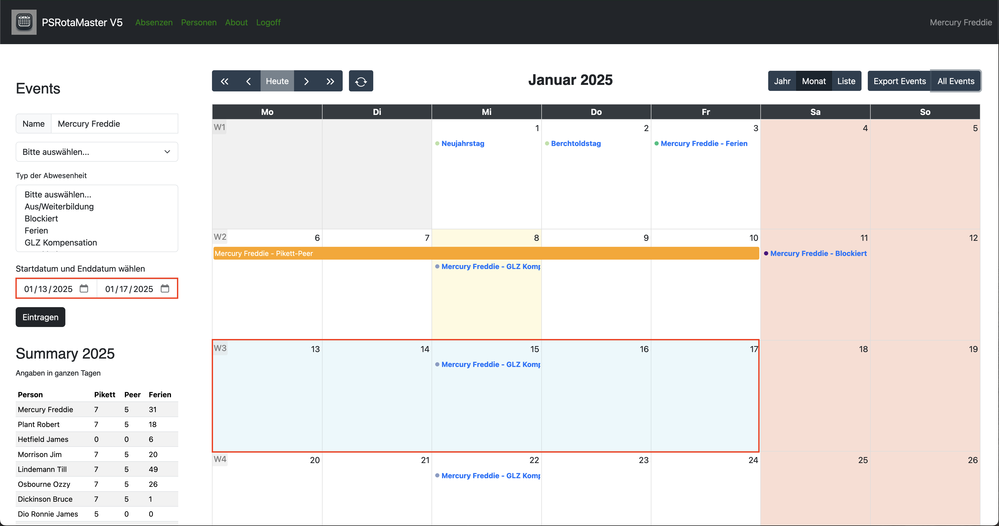

# RotaMaster V3

Absence and duty scheduling program for teams based on Pode, and [FullCalendar](https://fullcalendar.io/), created with ChatGPT prompt for JavaScript.

Each time the page is loaded, the system checks whether the file for the next year's holidays already exists. If the file does not yet exist, the public holidays in Switzerland are calculated for the cantons of Bern, Zurich, St. Gallen and Graubünden and the file is created with these values. You never have to worry about it again, the public holidays are simply there.

If you want to create the holidays for a different year, you can call the API with the desired year. For example with PowerShell:

````Invoke-WebRequest -Uri http://localhost:8080/api/year/new -Method Post -Body 2025````

## Year view

In this calendar view, you can view the events of the current month, scroll to another month, and add new events.


## Month view

To show the current month, click on the middle button 'month'.


## List view

Or if you prefere a list of the events of the current month, click on the right button 'list'.



## Add a range with form dates

Type, or select the person and select absence-type, choose the start- and end date, and press the button to submit the new event.


## Add a range with selecting dates

Select a range fills the selected start- and end date into the formular. Type or select the person and select the absence-type and press the button to submit the new event.



## Export

It's possible to export all events, or events of a specified person, or a single event as an ics-file.


## Functionality

The RotaMaster is a Web service based on Pode.

All of the APIs on the backend are written in PowerShell and the frontend is written in JavaScript and HTML/CSS.

It would be nice to use the [OpsGenie API](https://docs.opsgenie.com/docs/api-overview) to export/import Pikett-events into OpsGenie.

## Modules

The following PowerShell-Modules are mandatory:

- Pode
- PSSQLite

## Folders

The RotaMaster needs the following folder-structure:

````cmd
RotaMaster
+---api
+---archiv
+---bin
+---errors
+---img
+---public
|   +---assets
|   |   +---BootStrap
|   |   +---img
|   |   +---Jquery
|   |   \---rotamaster
|   \---img
\---views
````

### RotaMaster

This is the root-folder for the web service. Here must be the PodeServer.ps1 located.

### api

This folder contains the files of the web service. For example, the files for the public holidays, the absence type or the persons.

The files for the absence and people must be JSON files, and the file containing the holidays must be a CSV file.

The events have also been saved in a SQLite database called rotamaster.db in this folder.

### archiv

For obsolete files, that you want to archive and not load in to the calendar.

### bin

This folder contains the PowerShell code of the backend.

### errors

This is an internal folder for the error-page.

### img

Here are the images for the readme.

### public

This folder is public for the web service and should contains all the assets you need.

### views

This is the folder where the index.html is saved.
